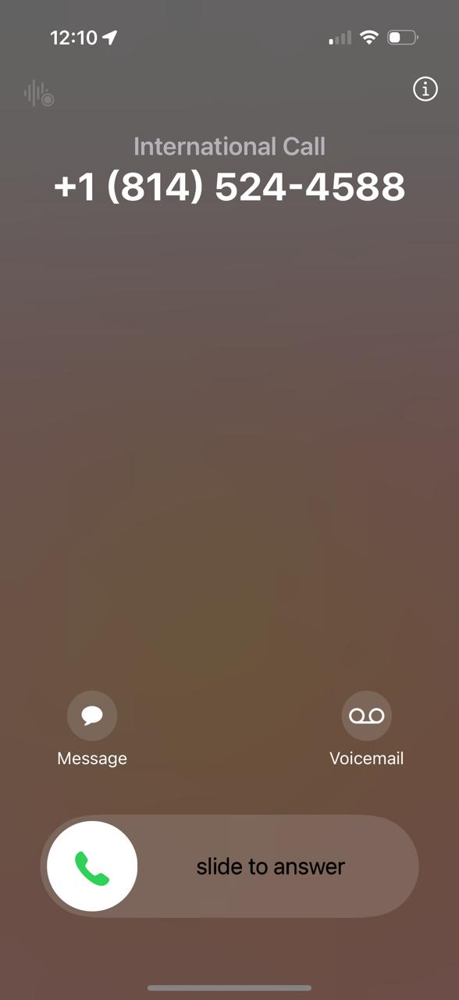

# AI Call Assistant

An intelligent outbound calling system powered by **VAPI AI**, **Make.com** workflows, and **Twilio** infrastructure. The assistant speaks fluent English and Hindi, switching naturally mid-conversation to match the caller.

## Core Architecture

### VAPI AI
The conversational AI engine for outbound calls. Delivers natural language understanding, bilingual (English/Hindi) fluency, and adaptive call handling.

### Make.com Workflows
Orchestrates the entire call pipeline:
- **Webhook Trigger**: Receives user data from the contact form
- **Supabase Integration**: Stores and retrieves contact information
- **Data Processing**: Normalizes phone numbers and user data
- **Array Aggregator**: Iterates through contacts for batch calling
- **HTTP Module**: Triggers VAPI calls with proper authentication and payload

### Twilio Integration
Provides the underlying telecommunications infrastructure:
- Phone number provisioning
- Call routing and management
- Inbound/outbound call handling
- IVR capabilities

[Get a Twilio number (available on trial accounts)](https://console.twilio.com/)

## System Flow

```
Contact Form → Node.js API → Make.com Webhook 
→ Supabase (Data Storage) → Data Processing 
→ VAPI AI Assistant → Twilio (Phone Calls)
```

## Key Capabilities

- Bilingual voice experiences in English and Hindi, including smooth code-switching
- Automated outbound campaigns with batch processing and contact enrichment
- Real-time orchestration via Make.com with Supabase-backed data
- Carrier-grade delivery and IVR options through Twilio
- Secure credential handling with API-keyed requests to VAPI and Twilio

## Setup & Configuration

### Prerequisites
- Node.js & npm
- VAPI AI account and API key
- Make.com account and workflow
- Twilio account with phone number
- Supabase project (for data storage)

### Installation

```bash
npm install
npm start
```

Server runs on: `http://localhost:3000`

## Configuration Guide

### 1. **Twilio Setup**
- Buy a phone number from [Twilio Console](https://console.twilio.com/)
- Note your phone number ID (used in Make.com workflow)

### 2. **VAPI Configuration**
- Create an AI assistant in [VAPI](https://vapi.ai)
- Configure assistant behavior and language settings
- Get your assistant ID and API key
- Set authentication headers in Make.com HTTP module

### 3. **Make.com Workflow**
- Webhook receives contact data
- Supabase module stores/retrieves phone numbers
- Array Aggregator processes batch calls
- HTTP module calls VAPI with payload:
  ```json
  {
    "customer": {
      "number": "{{phone_number}}",
      "name": "{{user_name}}",
      "extension": ""
    },
    "phoneNumberId": "<your_twilio_id>",
    "assistant": {{assistant_config}}
  }
  ```

### 4. **Server Integration**
Update `/api/call` endpoint in `server.js` to connect with your Make.com webhook

## Technologies

- **Backend**: Node.js, Express.js
- **AI**: VAPI AI
- **Workflow Automation**: Make.com
- **Telecommunications**: Twilio
- **Database**: Supabase
- **Frontend**: Vanilla HTML/CSS/JavaScript

## Screenshots

- Call outcome preview:  
     
- Make.com workflow orchestration: 


Feel free to reach out to me in case you have any queries!
